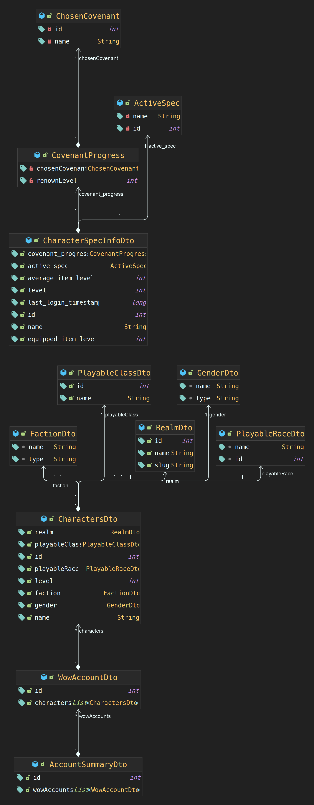

# OhMyRaid
*STILL IN PROGRESS..*
<hr>

## Description

OhMyRaid (OMR) is a REST-API service designed for World of Warcraft players. It simplifies the process of recruiting raiders and finding raid parties by leveraging data from Blizzard's World of Warcraft API((https://develop.battle.net/).


## Installation
To get started with OMR, follow these steps:

1. Clone the repository:
```bash
git clone https://github.com/donghyeon-dev/oh-my-raid.git
```

2. If you are using Docker, navigate to the Docker directory and start the service using Docker Compose:
```bash
cd docker
docker compose up -d
```
3. Set your OS environment variables
For example, in Linux or macOS:
```bash
export BLIZZARD_CLIENT_ID='your-client-id'
export BLIZZARD_CLIENT_SECRET='your-client-secret'
export PUBLIC_IP='THE WHOLE HOST(eg.MySQL, Redis, etc When you use dev profile)'
```
On Windows, use the respective command in Command Prompt or PowerShell.

## Usage
OMR operates in two Spring boot active profiles:
```
Development (dev): This profile uses Docker resources for running the services.
Local: This profile uses in-memory components for local testing and development.
```
To switch between profiles, adjust your environment configuration accordingly.

## Features
Using your blizzard accounts(by login to blizzard), we can ask blizzard to fetch that account's WoW data.
- Get account's all the character(level 60 upper) inofrmation
- Get simple raid career

### UML (data from Blizzard)
*블리자드에서 제공하는 레이드 API의 depth*
*블리자드에서 제공하는 캐릭터 API의 depth*
