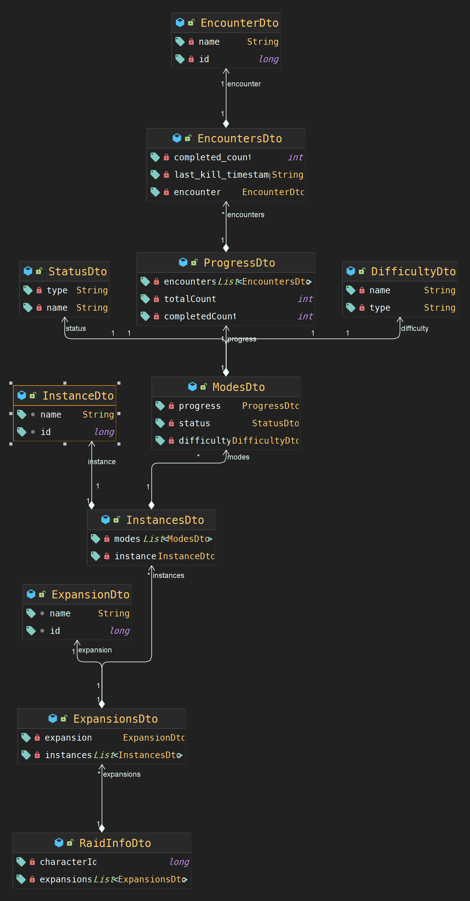

# OhMyRaid

<hr>

# How to run
1. Clone repository
```
git clone https://github.com/donghyeon-dev/oh-my-raid.git
```
2. If you want to run with docker 
``` bash
> cd docker
> docker-compose up -d
```
  
```
```

<hr>

사용한 API
- Battle.net API((https://develop.battle.net/)

사용기술
- Spring Data JPA
- MapStruct
- JUnit
- Feign
- Swagger
- Lombok


### 중첩된 For문을 사용하는 이유
*블리자드에서 제공하는 레이드 API의 depth*
*블리자드에서 제공하는 캐릭터 API의 depth*